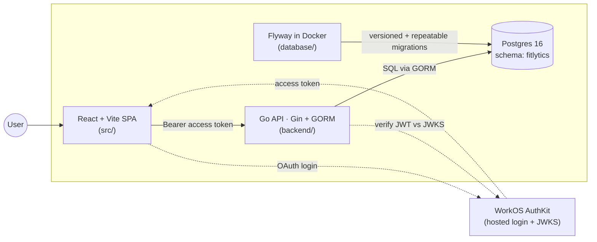

# fitlytics

Workout tracking and training analytics. Single repo containing the frontend
SPA, the Go backend API, and the Postgres schema + migrations.

## Architecture



- The **SPA** runs in the browser and talks to the API over HTTPS, sending
  the WorkOS access token in an `Authorization: Bearer ...` header.
- The **API** verifies the token's signature against WorkOS's published JWKS,
  resolves the WorkOS user id to a local `users` row (provisioning one on
  first sight), and scopes every query to that user.
- **Postgres** runs in Docker; all app objects live in the `fitlytics`
  schema. Flyway applies migrations on `docker compose up`.

## Repository layout

| Path | What lives here |
|------|-----------------|
| `src/` | React + TypeScript frontend (Vite, shadcn/ui, Tailwind) |
| `public/` | Static frontend assets served by Vite |
| `backend/` | Go API service |
| `database/` | docker-compose for Postgres + Flyway, and the migration files |
| `index.html`, `vite.config.ts`, `tsconfig*.json` | Frontend toolchain config at repo root |

## Tech stack

| Layer | Stack |
|-------|-------|
| Frontend | React 19 · TypeScript · Vite 7 · Tailwind 4 · shadcn/ui · TanStack Query · TanStack Table |
| Backend | Go 1.25 · Gin · GORM · `log/slog` · `gorm/gen` (database-first models) |
| Database | Postgres 16 · Flyway (versioned + repeatable migrations) |
| Auth | WorkOS AuthKit (JWT access tokens verified against WorkOS JWKS) |

## Prerequisites

- **Node 20.19+** (Vite 7)
- **pnpm** — `pnpm-lock.yaml` is the lockfile of record
- **Go 1.25+**
- **Docker Desktop** (or Docker Engine + Compose v2)
- A **WorkOS** account for protected routes — `/healthz` works without auth

## Running locally

Open three terminals (DB, backend, frontend). They're independent — start in
any order, but the API needs the DB up before it can serve `/healthz` cleanly.

### 1. Database

```bash
cd database
docker compose up -d
docker compose logs -f flyway   # confirm "Successfully applied N migrations"
```

That brings up Postgres on `localhost:5432` and runs Flyway with `clean migrate`
— **destructive** on the data volume, ideal while iterating on the schema.
Credentials: `fitlytics / fitlytics`, database `fitlytics`.

### 2. Backend

```bash
cd backend
cp .env.example .env       # fill in WORKOS_API_KEY and WORKOS_CLIENT_ID
go run ./cmd/api
```

API listens on `http://localhost:8080`. Verify with:

```bash
curl http://localhost:8080/healthz
```

### 3. Frontend

```bash
pnpm install
pnpm dev
```

Vite dev server with HMR on `http://localhost:5173`.

> The frontend calls the API at `localhost:8080`. For local dev you'll need
> either a Vite proxy entry or CORS middleware on the API — neither is wired
> up yet.

## API endpoints

| Method | Path | Auth | Description |
|--------|------|------|-------------|
| GET | `/healthz` | none | Liveness + DB connection check |
| GET | `/api/me` | yes  | Returns the authenticated caller's profile |

Protected routes (`/api/*`) require an `Authorization: Bearer <WorkOS access token>` header. See the auth section below for how the middleware validates it.

## Environment variables

`.env` lives in `backend/` (git-ignored). See `backend/.env.example` for the
full list. The required ones:

| Var | Notes |
|-----|-------|
| `DATABASE_URL` | URL-form DSN; default matches `database/docker-compose.yml` |
| `WORKOS_API_KEY` | `sk_test_...` from the WorkOS dashboard |
| `WORKOS_CLIENT_ID` | `client_...` from the WorkOS dashboard |

`WORKOS_JWKS_URL` and `WORKOS_JWT_ISSUER` are derived from the client id and
only need to be set if the derivation is wrong.

## Common commands

### Frontend (from repo root)

| Command | What it does |
|---------|--------------|
| `pnpm install` | Install dependencies |
| `pnpm dev` | Vite dev server with HMR |
| `pnpm build` | Type-check + production build into `dist/` |
| `pnpm preview` | Serve the production build locally |
| `pnpm typecheck` | `tsc --noEmit` |
| `pnpm lint` | ESLint over the repo |
| `pnpm format` | Prettier (writes `**/*.{ts,tsx}`) |

### Backend (from `backend/`)

| Command | What it does |
|---------|--------------|
| `go run ./cmd/api` | Run the API |
| `go build ./...` | Compile all packages |
| `go vet ./...` | Static checks |
| `go mod tidy` | Sync `go.mod` / `go.sum` |
| `go run ./cmd/gen` | Regenerate GORM models from the live DB schema |
| `make run` / `make build` / `make generate` | Same as above via Makefile |

### Database (from `database/`)

| Command | What it does |
|---------|--------------|
| `docker compose up -d` | Start Postgres + run Flyway `clean migrate` |
| `docker compose down` | Stop containers (keeps data volume) |
| `docker compose down -v` | Stop and **wipe** the data volume |
| `docker compose logs -f flyway` | Tail the Flyway migration output |
| `docker exec -it fitlytics_db psql -U fitlytics -d fitlytics` | Open a psql shell against the DB |

Convenience targets from `backend/`: `make db-up`, `make db-down`,
`make db-reset`, `make db-logs`.

## Adding a database migration

Schema is owned by Flyway. Two flavors:

- **Versioned** (`database/flyway/sql_versioned/V<n>__<name>.sql`) — stateful
  DDL: new tables, new columns, indexes, `ALTER TYPE ... ADD VALUE`. Run once,
  in version order.
- **Repeatable** (`database/flyway/sql_repeatable/R__<name>.sql`) — idempotent
  SQL: `CREATE OR REPLACE VIEW`, `CREATE OR REPLACE FUNCTION`, seed inserts
  with `ON CONFLICT DO NOTHING`. Flyway re-runs them when their checksum
  changes.

Example — add an `injuries` table:

```bash
# 1. Write the migration
$EDITOR database/flyway/sql_versioned/V2__injuries.sql

# 2. Re-apply from scratch (dev only — wipes data)
cd database && docker compose down -v && docker compose up -d

# 3. Regenerate Go models so they include the new table
cd ../backend && go run ./cmd/gen

# 4. Build to catch any breakage from the regen
go build ./...
```

## Regenerating Go models from the schema

This project is **database-first**: `backend/internal/models/*.gen.go` and
`backend/internal/query/*.gen.go` are produced from the live DB by
`gorm.io/gen`, the GORM analogue of EF Core's `Scaffold-DbContext`.

```bash
cd backend
go run ./cmd/gen
```

The generator config (`backend/cmd/gen/main.go`) pins the type mappings gen
can't infer (uuid, jsonb, enum arrays, soft-delete) and wires the navigation
fields for the program/session trees. Don't hand-edit `.gen.go` files — change
the schema and regenerate.

## Auth in one paragraph

Login happens at WorkOS's hosted AuthKit page; the frontend ends up with a
short-lived JWT access token. Every request to `/api/*` includes that token
as `Authorization: Bearer <token>`. The backend's `RequireAuth` middleware
verifies the signature against WorkOS's JWKS, looks the WorkOS user id up
in the local `users` mirror (provisioning a row on first sight via the
WorkOS API), and attaches an `auth.Principal` (local user + role +
permissions) to the request context. Handlers read it with
`auth.MustPrincipal(c)`. Roles and permissions are read from the verified
token — they are **not** mirrored into Postgres.

## Useful references

- [`database/docker-compose.yml`](database/docker-compose.yml) — Postgres + Flyway compose
- [`database/flyway/sql_versioned/V1__001_init.sql`](database/flyway/sql_versioned/V1__001_init.sql) — full initial schema with inline design notes
- [`backend/cmd/gen/main.go`](backend/cmd/gen/main.go) — `gorm/gen` config with the type mappings and navigation-field wiring
